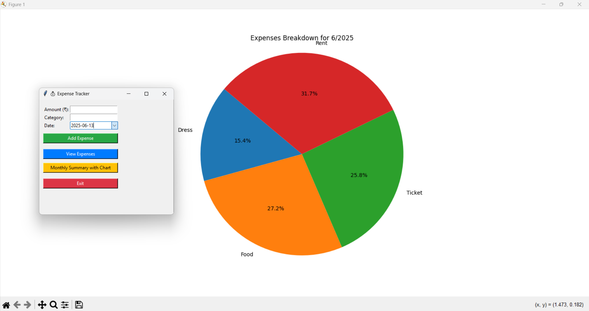

# 💰 Expense Tracker (Tkinter + JSON + Excel)

A simple and lightweight personal expense tracker built with Python's `tkinter` GUI toolkit. This app allows users to log expenses, view summaries, and visualize monthly spending using a pie chart.

---

## 🚀 Features

- 📅 Date picker using a calendar widget (no manual typing!)
- 📂 Save expenses in both **JSON** and **Excel** formats
- 📋 View all recorded expenses
- 📊 Generate **monthly summaries** with pie chart visualization
- 📈 Automatically creates and updates an `expenses.xlsx` file
- 🛡️ Clean UI and error handling with helpful prompts

---

## 🖼️ Screenshots

### 📊 Monthly Summary Pie Chart

---

## 🛠️ Tech Stack

- Python 3.x
- tkinter (for GUI)
- tkcalendar (for date picking)
- matplotlib (for charts)
- openpyxl (for Excel file support)
- json (for data persistence)

